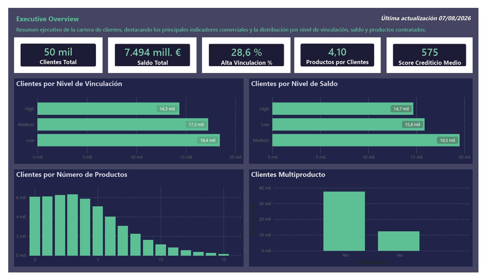
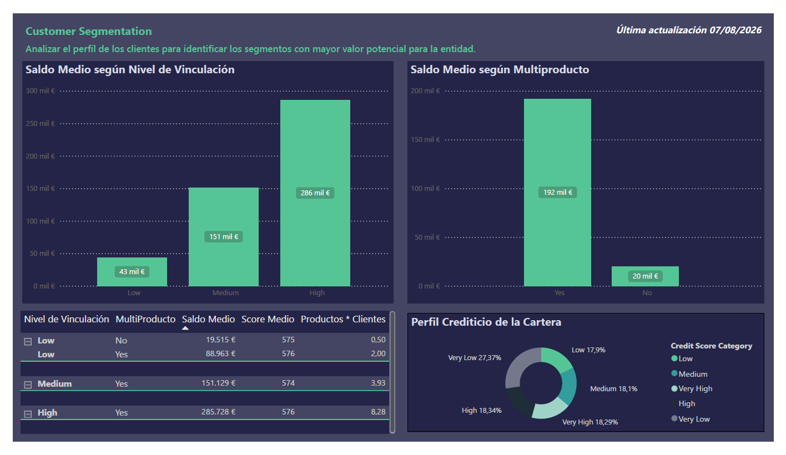
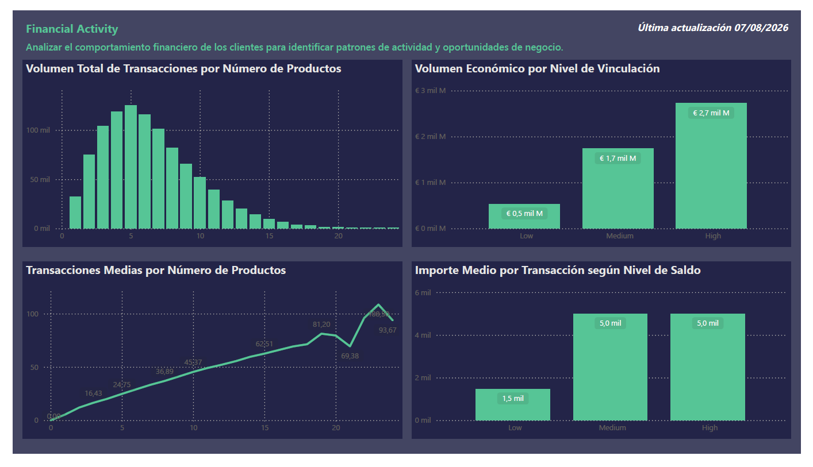
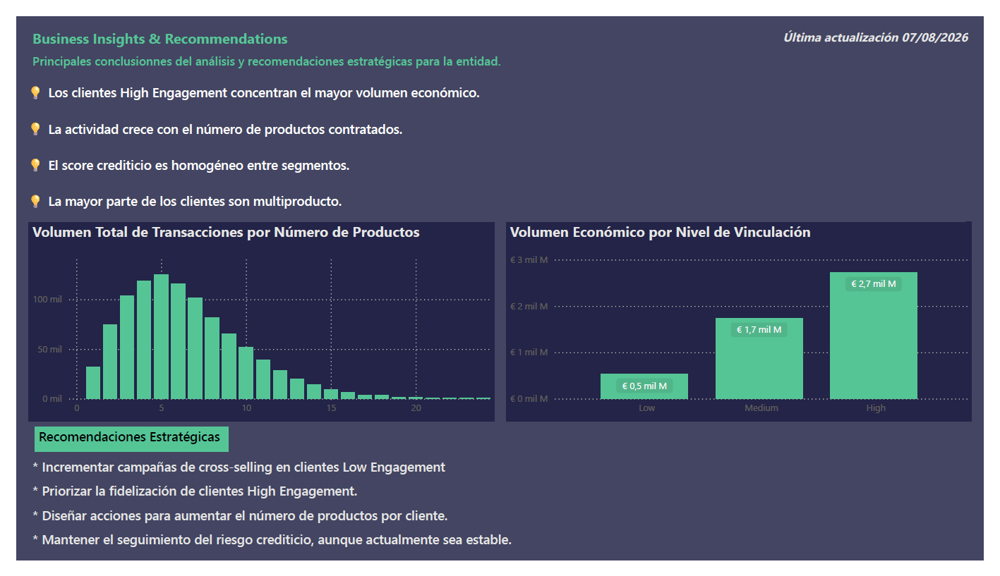

# 🏦 Retail Banking Customer Intelligence

## Project Highlights

- End-to-end Business Intelligence workflow
- Python data preparation and feature engineering
- SQL business analysis
- Interactive Power BI dashboards
- Customer segmentation and financial activity analysis
- Business insights and strategic recommendations

---

> End-to-end Business Intelligence project focused on analyzing a retail banking customer portfolio through SQL, Python and Power BI to support commercial decision-making.



---

# 📖 Introduction

Retail Banking Customer Intelligence is a fictional Business Intelligence project developed for a retail banking environment.

The objective is to transform customer financial data into actionable business insights by combining SQL analytics, Python data preparation and interactive Power BI dashboards.

The project follows a complete analytics workflow, from data preparation to executive reporting, providing decision-makers with a comprehensive understanding of customer engagement, financial activity and commercial opportunities.

---

# 🎯 Project Objective

The objective of this project is to design and develop a complete Business Intelligence solution capable of analyzing a banking customer portfolio from multiple business perspectives.

The project includes data preparation with Python, business-oriented SQL analysis and the development of interactive Power BI dashboards that support customer segmentation, financial analysis and strategic decision-making.

---

## 📊 Dataset

The project uses a fictional retail banking customer dataset designed to simulate a real-world banking environment.

The dataset contains customer information, financial products, account balances, customer engagement indicators and transaction activity.

It is used exclusively for analytical and portfolio purposes.

---

# 🛠️ Technologies Used

| Category | Technologies |
|----------|--------------|
| Programming | Python |
| Data Analysis | Pandas |
| Database | SQLite |
| Query Language | SQL |
| Business Intelligence | Power BI |
| Version Control | Git |
| Repository | GitHub |

---

# 📁 Project Structure

```text
RETAIL-BANKING-CUSTOMER-INTELLIGENCE
│
├── data/
│   ├── raw/
│   └── processed/
│
├── docs/
│   ├── PROJECT_DEFINITION.md
│   ├── DASHBOARD_DESIGN.md
│   ├── KPI_CATALOG.md
│   ├── INSIGHTS.md
│   ├── PYTHON_PLAN.md
│   ├── DECISION_LOG.md
│   └── CHANGELOG.md
│
├── documentation/
│
├── images/
│   └── dashboard/
│
├── sql/
│
├── README.md
└── requirements.txt
```

---

# 🔄 Project Workflow

The project follows a complete Business Intelligence workflow, transforming raw customer information into strategic business recommendations.

```text
Raw Dataset
      │
      ▼
Data Preparation (Python)
      │
      ▼
Business Analysis (SQL)
      │
      ▼
Interactive Dashboard (Power BI)
      │
      ▼
Business Insights
      │
      ▼
Business Recommendations
```

---

# 📊 Power BI Dashboards

The Business Intelligence solution is organized into four interactive dashboards, each designed to answer a specific business question and support strategic decision-making.

---

## Executive Overview


### Objective

Provide an executive overview of the customer portfolio through the main commercial KPIs and customer distribution indicators.

### Key Business Questions

- What is the current status of the customer portfolio?
- How is the portfolio distributed by engagement level?
- What is the average customer financial profile?
- How many products does the average customer own?

---

## Customer Segmentation



### Objective

Analyze customer financial profiles to identify the most valuable customer segments.

### Key Business Questions

- Which customer segments generate the highest value?
- How does customer engagement affect financial value?
- How is credit risk distributed across the portfolio?
- What role does multi-product adoption play?

---

## Financial Activity



### Objective

Analyze customer financial behavior through transaction activity and product utilization.

### Key Business Questions

- How does financial activity evolve with the number of products?
- Which engagement levels generate the highest transaction volume?
- What is the average transaction value across customer segments?
- Which customer profiles generate the greatest economic activity?

---

## Business Insights & Recommendations



### Objective

Summarize the main findings of the project and translate them into strategic business recommendations.

### Key Business Questions

- What are the main business opportunities?
- Which customer segments should be prioritized?
- Which commercial actions could increase customer value?
- How can the current portfolio be optimized?

---

# 💡 Key Business Insights

The analysis identified several relevant findings that support strategic decision-making within the banking environment.

- **Customer Engagement:** Highly engaged customers generate the largest economic value across the portfolio.

- **Financial Activity:** Transaction activity increases consistently as customers adopt additional financial products.

- **Credit Profile:** Credit score remains relatively stable across customer segments and does not fully explain customer value.

- **Cross-selling Opportunities:** Customers with multiple financial products exhibit higher balances and stronger financial activity.

- **Business Strategy:** Increasing customer engagement and product adoption represents the greatest opportunity for future portfolio growth.

---

# 📚 Additional Documentation

The repository includes detailed technical documentation describing every stage of the project.

- 📄 PROJECT_DEFINITION.md
- 📄 DASHBOARD_DESIGN.md
- 📄 KPI_CATALOG.md
- 📄 PYTHON_PLAN.md
- 📄 INSIGHTS.md
- 📄 DECISION_LOG.md
- 📄 CHANGELOG.md

---

# 👤 Author

**Isabelo Castillo**

Data Analyst focused on Business Intelligence, SQL, Python and Power BI.

GitHub: https://github.com/IsabeloCastillo
